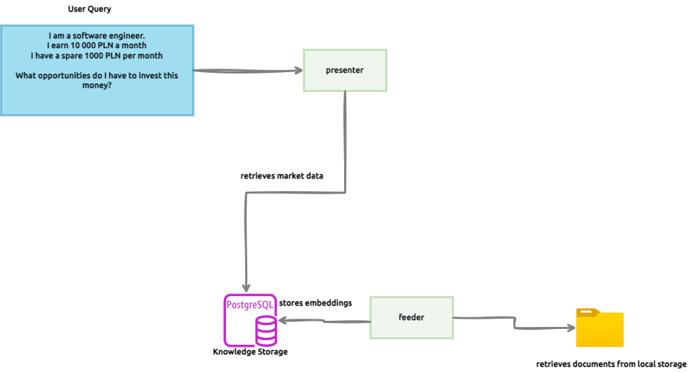

# About

Project developed as part of CapGemini's "From Zero to GenAI Hero" training path.

## Architecture

**WIP:** The architecture diagram is a work in progress and will be updated as the project progresses.

## Technical Stack

* Java 17+
* Maven
* Spring Boot
* Langchain4j
* Podman
* Ollama - Tested locally using Mistral AI

## Build
`mvn clean install`

## Run
1. Initialise local database by using podman:

`podman-compose -f feeder/db/podman-compose.yml up`
2. Load data by:
* Including files you consider relevant to feeder/src/main/resources/data
* Run [FeederApplication.java](feeder%2Fsrc%2Fmain%2Fjava%2Fcom%2Fcapgemini%2Finvestmentassistant%2FFeederApplication.java)
3. Change [StartupPrompt.java](presenter%2Fsrc%2Fmain%2Fjava%2Fcom%2Fcapgemini%2Finvestmentassistant%2Fprompt%2FStartupPrompt.java) as you deem necessary based on your goals and targets
4. Run [PresenterApplication.java](presenter%2Fsrc%2Fmain%2Fjava%2Fcom%2Fcapgemini%2Finvestmentassistant%2FPresenterApplication.java)